# RaktaSetu — emergency blood & platelet donor network

> **Ship It track · AWS Bharat Builds Tour "First Commit" · Sept 17–20, 2026**

RaktaSetu matches **verified, eligible donors in the same city** to urgent blood/platelet requests in **seconds** — not the classic midnight WhatsApp chain. Matching donors get an **SMS + in-app alert** instantly; the requester is notified the moment a donor confirms. An **AI assistant** (Amazon Bedrock · Nova) answers donor-eligibility questions and can even **post a request from chat**.

The live URL is printed by the deploy script (frontend hosted on S3 + CloudFront).

## The problem

India's blood-bank system collects millions of units but still faces chronic shortages during emergencies:

- Requests travel by **phone tree and forwarded WhatsApp messages** — slow, uncoordinated, unverifiable.
- A willing donor who registered at a drive is **never matched** to the need in their own city.
- Whole blood expires after **42 days**; the network stays empty while eligible donors go unused.

**What changes:** an emergency request posted at 2 a.m. reaches up to 20 eligible donors in the same city within seconds, with a direct line back to the requester. That is the difference between "waiting for the morning" and "help arriving tonight."

## The build

A fully serverless, one-command-deploy application running entirely inside the **AWS Free Tier**:

| Layer | Services |
|---|---|
| Frontend | **S3 + CloudFront** (static SPA, no build step), private bucket via Origin Access Control |
| API | **API Gateway** REST, Cognito-authorised (only `/stats` is public) |
| Compute | 9 **Lambda** functions (Python 3.12) |
| Data | **DynamoDB** (on-demand / PAY_PER_REQUEST): users, donors, requests, matches — with GSIs powering the hot matching + expiry queries |
| Notifications | **Amazon SNS** SMS alerts (SenderID `RAKTA`) |
| Orchestration | **EventBridge** scheduled rule → expiry sweeper |
| Auth | **Amazon Cognito** user pool (email signup + verification) |
| AI | **Amazon Bedrock · Nova** via the Converse API with tool use |

## Architecture

```mermaid
flowchart LR
    U[Browser SPA<br/>S3 + CloudFront] -->|REST /prod| G[Amazon API Gateway]
    G -->|Authorizer| C[Cognito User Pool]
    G -->|POST /requests| CR[createRequest]
    G -->|GET /requests| LR[listRequests]
    G -->|PATCH /requests/id| UR[updateRequest]
    G -->|GET PUT /donors/me| DR[donor]
    G -->|GET /matches/me| MR[matches]
    G -->|POST /matches/id/respond| RR[respondMatch]
    G -->|GET /stats public| SR[stats]
    G -->|POST /assistant| AR[assistant]
    G -.scheduled 6h.-> ER[expireStale]

    CR --> D1[("requests")]
    CR --> D2[("donors")]
    CR --> D3[("matches")]
    CR -.SMS.-> SNS[Amazon SNS]
    LR --> D1
    UR --> D1
    DR --> D2
    MR --> D3
    RR --> D3
    SR --> D1
    SR --> D2
    AR -->|tool: create_request| D1
    AR --> B[Amazon Bedrock<br/>Nova]
    SNS -.-> Phone[Donor phones]
```



**Request lifecycle:** post → validate → guard (only one *open* request per user per blood+city → 409 on dupes) → write (DynamoDB TTL = 24h urgent / 72h planned) → query donors GSI (`blood_type` partition, `city#` prefix) → up to 20 eligible+available matches → SMS each donor + confirmation SMS to requester → donor confirms/declines (idempotent; can't respond twice) → requester gets the donor's number → fulfill/cancel notifies confirmed donors and cascades status → expiry sweeper closes pending matches and TTL cleans up.

## Repo layout

```
template.yaml          # full SAM stack (27 resources, one deploy)
deploy.ps1 / deploy.sh # ONE-COMMAND deploy: build -> stack -> frontend -> URL
src/
  layer/python/shared/  # shared layer: DDB access, SMS, validation, API helpers, matching domain
  create_request/       # post request + match + alert (409 on duplicate open request)
  list_requests/        # browse by status / type / city
  my_requests/          # GET /requests/mine — requester's own requests (new GSI)
  update_request/       # fulfill / cancel + donor notifications
  donor/                # donor profile + eligibility flag
  matches/              # "My Alerts"
  respond_match/        # confirm / decline (idempotent)
  stats/                # public live dashboard
  assistant/            # Bedrock Nova agent (tool use: create/list/my requests)
  expire_stale/         # EventBridge sweeper (cascades to pending matches)
frontend/               # vanilla JS SPA (no build step)
scripts/                # seed (+ history), smoke test, local logic tests (33 checks)
```

Plus: `prd.md`, `architecture.md`, `design.md`, `rules.md`, `task.md`, `memory.md`.

## Quickstart

Prereqs: **AWS account on the Free Tier** (up to $200 credits), AWS CLI, SAM CLI.

```powershell
# 1. install CLI tools
winget install Amazon.AWSCLI
winget install aws-sam-cli        # or: pip install aws-sam-cli
aws configure

# 2. one command to ship everything
.\deploy.ps1

# 3. open the printed Frontend URL, sign up, confirm email, post a request
```

Local / offline (Build It style):

```powershell
sam local start-api --template template.yaml
python scripts/test_local.py        # pure-logic tests, no AWS needed
```

Live smoke test after deploy:

```powershell
python scripts/smoke.py <ApiEndpoint>
python scripts/seed_sample_data.py  # demo donors + open requests
```

Re-push frontend edits only:

```powershell
.\deploy.ps1 -FrontendOnly
```

## Security

- Every endpoint except `GET /stats` sits behind the **Cognito JWT authorizer** (verified by API Gateway).
- The S3 bucket is **private**; served only through CloudFront **Origin Access Control** with a source-ARN-conditioned bucket policy.
- IAM is least-privilege: per-table `DynamoDBCrudPolicy`, `sns:Publish`, `bedrock:InvokeModel`, CloudWatch logs.
- Phone numbers stored in E.164, validated server-side, exposed only inside the matched flow.

## Cost posture (Free Tier, full weekend)

Everything runs on-demand: **~$0 for the hackathon.** Lambda 1M req/mo free, API Gateway 1M free, DynamoDB on-demand pennies, SNS SMS within 100/mo free, Cognito 50k MAU free, Bedrock Nova pennies, S3/CloudFront pennies. Full table in `architecture.md`.

## What we learned

- **One SAM template + a no-build frontend = one-command shipping.** Serverless scaffolds that drag a full npm/webpack pipeline eat the weekend.
- **Fresh-account email is the trap:** SES is sandboxed to verified recipients and SNS email endpoints need opt-in confirmations. For outbound emergency alerts, **SMS via SNS works out of the box** and tells a better story.
- **DynamoDB design drives the business logic:** a composite GSI (`blood_type` + `city#` prefix) turned "find matching donors" into a single `Query` call; TTL plus an EventBridge sweeper handle the lifecycle with no cron-vm boilerplate.
- **Bedrock Converse tool use** is a small, reliable way to give an assistant real actions — one tool, one loop, graceful fallback.

## AI tools used (required disclosure)

- **OpenCode** (model: `opencode/big-pickle`) — scaffolding, Lambda code, frontend, docs, and deployment scripts.

## License

MIT — see `LICENSE`. Team retains all rights to the idea.