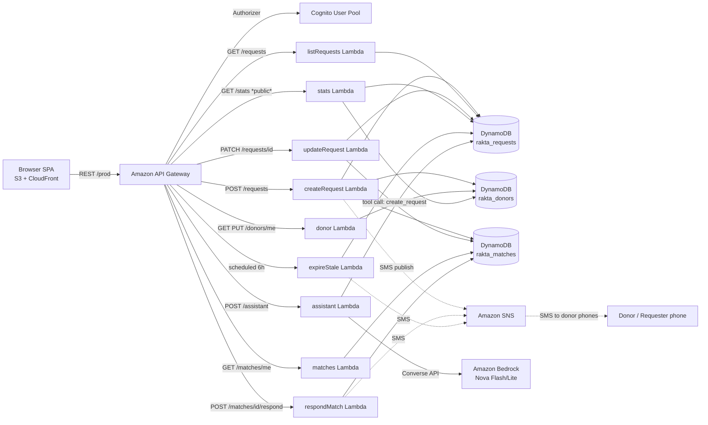

# Architecture — RaktaSetu

## 1. System overview

Everything is **serverless**, defined in a single SAM template (`template.yaml`), and runs inside the **AWS Free Tier** (Pay-per-request DynamoDB, Lambda, API Gateway, SNS, S3, CloudFront, Cognito, Bedrock).

## 2. Request lifecycle (the happy path)

1. `POST /requests` → `createRequest`
   - Validates type/city/phone (E.164 +91)
   - Writes `rakta_requests` row, status=`open`, `ttl` = T+24h (urgent) / T+72h (planned)
   - Upserts requester profile in `rakta_users`
   - Queries `rakta_donors` **GSI `DonorMatchIndex`** (`blood_type` partition, `city#` prefix on sort key)
   - Filter: `donation_eligible=true AND available=true`
   - Writes up to 20 `rakta_matches` rows (status=`sent`)
   - Publishes SMS to each matched donor + confirmation SMS to requester (SNS)
2. Donor sees the alert **in-app (My Alerts)** or via SMS → `POST /matches/{id}/respond` (confirm/decline)
   - `confirm` → SMS to requester with donor name + phone, and `confirmed_count += 1` on the request (`declined_count += 1` on decline; both idempotent — re-responding never double-counts, and confirming a non-open request is rejected)
3. Requester `PATCH /requests/{id}` → `fulfill` (or `cancel`)
   - Cancellation notifies donors; fulfill marks done
4. **Expiry sweep** (EventBridge, every 6h) → `expireStale`
   - Queries GSI `StatusIndex` for `status=open AND expires_at < now`
   - Marks `expired`, notifies requester, TTL later deletes the row

## 3. Data model (DynamoDB)

### `rakta_users`
| Key | Attrs |
|---|---|
| `user_id` HASH | email, name, phone, is_donor |

GSI: `EmailIndex` (email), `PhoneIndex` (phone)

### `rakta_donors`
| Key | Attrs |
|---|---|
| `donor_id` HASH | name, phone, blood_type, city, last_donation, donation_eligible, available |

GSI: `DonorMatchIndex` — **PK `blood_type`, SK `city#+donor_id`** (enables the hot-path query)

### `rakta_requests`
| Key | Attrs |
|---|---|
| `request_id` HASH | requester_id, requester_name, requester_phone, blood_type, city, hospital, note, units, urgency, status, confirmed_count, declined_count, created_at, expires_at, **ttl** |

GSI: `StatusIndex` — PK `status`, SK `expires_at` (enables the expiry sweep)
GSI: `RequesterIndex` — PK `requester_id`, SK `created_at` (powers `GET /requests/mine` + the duplicate-open-request guard)

`GET /requests` returns newest-first and exposes the counts; `GET /stats` adds `donors_ready` (available + donation-eligible donors).

### `rakta_matches`
| Key | Attrs |
|---|---|
| `match_id` HASH | donor_id, donor_name, donor_phone, request_id(+snapshot), status(sent/confirmed/declined/cancelled), created_at |

GSI: `DonorIndex` (PK donor_id), `RequestIndex` (PK request_id)

## 4. AI assistant (Bedrock agent)

`POST /assistant` → `Converse API` (`amazon.nova-lite-v1:0`, configurable) with **tool use**:

- `create_request` tool → agent can directly post a request from chat ("I need B+ plasma in Pune")
- Eligibility Q&A answered from the grounded system prompt (Indian Ministry of Health donor criteria)
- Defensive fallback: if Bedrock is unavailable, responds helpfully instead of failing

## 5. Security

- All APIs except `GET /stats` are behind the **Cognito authorizer** (JWT verified by API Gateway).
- Frontend served via S3 + **CloudFront OAC** (no public S3 buckets).
- CORS locked to the required headers; no secrets in client code (authenticate via Cognito, only tokens).
- SMS SenderID fixed (`RAKTA`); phone fields validated server-side.
- IAM: least-privilege — per-table `DynamoDBCrudPolicy`, `sns:Publish`, `bedrock:InvokeModel`, CloudWatch logs only.

## 6. Cost posture (free tier, per 4 days)

| Service | Estimate |
|---|---|
| Lambda | ~0.5M requests → $0 (1M free/mo) |
| DynamoDB | PAY_PER_REQUEST, tiny workload → pennies |
| API Gateway | ~1M requests → $0 (1M free/mo) |
| SNS SMS | <100 msgs → free tier |
| S3 + CloudFront | pennies |
| Cognito | 50k MAU free → $0 |
| Bedrock Nova | ~100k tokens → pennies |

Credits available: AWS Free Tier up to **$200** on a fresh account + **$100/team** on request.

## 7. Testing story

- Unit tests: `scripts/test_local.py` (pure logic: validation, expiry math, matching filter).
- Local run (Build It fallback): `sam local start-api`.
- Deployed smoke test: `scripts/smoke.py` (unauthenticated /stats + auth flow via Cognito SDK).
- Sample seed data: `scripts/seed_sample_data.py`.